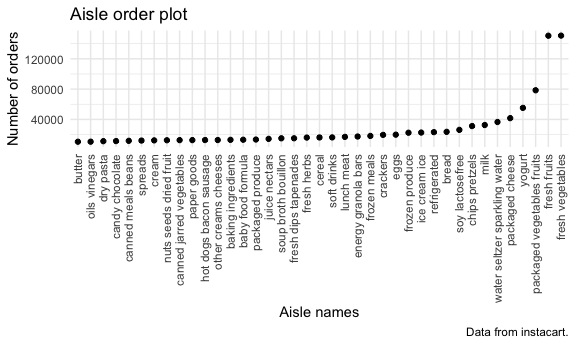
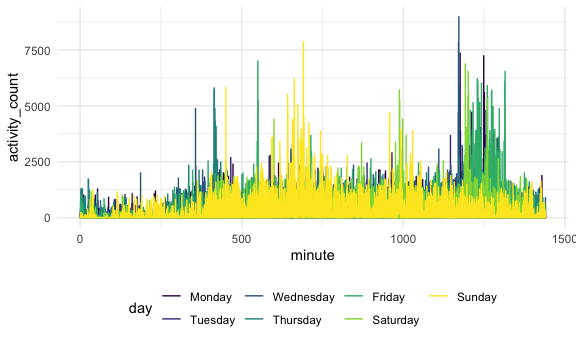
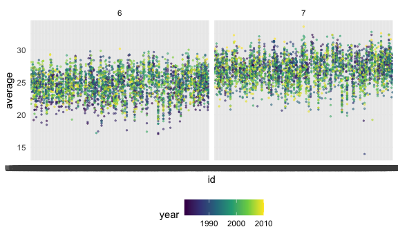
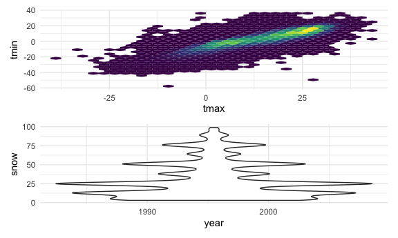

Homework 3
================
Megan Marziali

## Beginning infrastructure

This code chunk calls any relevant libraries and setting options.

``` r
library(tidyverse)
library(p8105.datasets)
library(patchwork)

knitr::opts_chunk$set(
  fig.width = 6,
  fig.asp = 0.6,
  out.width = "90%"
)

theme_set(theme_minimal() + theme(legend.position = "bottom"))

options(
  ggplot2.continuous.colour = "viridis",
  ggplot2.continuous.fill = "viridis"
)

scale_colour_discrete = scale_color_viridis_d
scale_fill_discrete = scale_fill_viridis_d
```

## Problem 1

#### Loading instacart dataset

The following code chunk loads the Instacart dataset

``` r
data("instacart")
```

This dataset contains 1384617 rows and 15 columns. Obervations are the
level of items in orders by users. There are user / order variables –
user\_id, order id, order day, and order hour. There are also item
variables – name, aisle, department and some numeric codes.

#### Answering specific questions

The following code is to check how many aisles.

``` r
instacart %>% 
  count(aisle) %>% 
  arrange(desc(n))
```

Now, we need to make a plot of the number of orders purchased per aisle.

``` r
instacart %>% 
  count(aisle) %>% 
  filter(n > 10000) %>% 
  mutate(
    aisle = factor(aisle),
    aisle = fct_reorder(aisle, n)
  ) %>% 
  ggplot(aes(x = aisle, y = n)) + 
  geom_point() +
  theme(axis.text.x = element_text(angle = 90, vjust = 0.5, hjust = 1)) +
  labs(
    title = "Aisle order plot",
    x = "Aisle names",
    y = "Number of orders",
    caption = "Data from instacart."
    )
```



Let’s make a table\!

``` r
instacart %>% 
  filter(aisle %in% c(
    "baking ingredients", "dog food care", "packaged vegetables fruits")) %>% 
  group_by(aisle) %>% 
  count(product_name) %>% 
  mutate(rank = min_rank(desc(n))) %>% 
  filter(rank < 4) %>% 
  arrange(aisle, rank) %>% 
  knitr::kable()
```

| aisle                      | product\_name                                 |    n | rank |
| :------------------------- | :-------------------------------------------- | ---: | ---: |
| baking ingredients         | Light Brown Sugar                             |  499 |    1 |
| baking ingredients         | Pure Baking Soda                              |  387 |    2 |
| baking ingredients         | Cane Sugar                                    |  336 |    3 |
| dog food care              | Snack Sticks Chicken & Rice Recipe Dog Treats |   30 |    1 |
| dog food care              | Organix Chicken & Brown Rice Recipe           |   28 |    2 |
| dog food care              | Small Dog Biscuits                            |   26 |    3 |
| packaged vegetables fruits | Organic Baby Spinach                          | 9784 |    1 |
| packaged vegetables fruits | Organic Raspberries                           | 5546 |    2 |
| packaged vegetables fruits | Organic Blueberries                           | 4966 |    3 |

Apples vs ice cream …

``` r
instacart %>% 
  filter(product_name %in% c("Pink Lady Apples", "Coffee Ice Cream")) %>% 
  group_by(product_name, order_dow) %>% 
  summarize(mean_hour = mean(order_hour_of_day)) %>% 
  pivot_wider(
    names_from = order_dow,
    values_from = mean_hour
  )
```

    ## # A tibble: 2 x 8
    ## # Groups:   product_name [2]
    ##   product_name       `0`   `1`   `2`   `3`   `4`   `5`   `6`
    ##   <chr>            <dbl> <dbl> <dbl> <dbl> <dbl> <dbl> <dbl>
    ## 1 Coffee Ice Cream  13.8  14.3  15.4  15.3  15.2  12.3  13.8
    ## 2 Pink Lady Apples  13.4  11.4  11.7  14.2  11.6  12.8  11.9

## Problem 2

The following code is to load in the accelerometer data.

``` r
accel_df = 
  read_csv("./problem2/accel_data.csv",
           na = "") %>% 
  janitor::clean_names() %>% 
  pivot_longer(
    activity_1:activity_1440,
    names_to = "minute",
    names_prefix = "activity_",
    values_to = "activity_count"
  ) %>% 
  mutate(
    day_type = recode(
      day, 
      Monday = "Weekday",
      Tuesday = "Weekday",
      Wednesday = "Weekday",
      Thursday = "Weekday",
      Friday = "Weekday", 
      Saturday = "Weekend",
      Sunday = "Weekend"),
    day = factor(day),
    day = forcats::fct_relevel(day, c("Monday",
                                      "Tuesday",
                                      "Wednesday",
                                      "Thursday",
                                      "Friday",
                                      "Saturday",
                                      "Sunday")),
    minute = as.integer(minute)
  )
```

This dataset includes accelerometer data collected from a 65 year old
patient. Observations correspond to activity counts over the course of
24 hours. The variables included are week, day\_id, day, minute,
activity\_count, day\_type. There are a total of 50400 rows and 6
columns. Activity counts were taken every minute of the day, for a total
of 1440 minutes. Measurements were taken every Monday, Tuesday,
Wednesday, Thursday, Friday, Saturday, Sunday, for a total of 5 weeks
and 35 days.

The value of the accelerometer readings as per the activity\_count
variable ranges from 1 to 8982. The mean of the accelerometer readings
is 267.0440592, with a standard deviation of 443.1575016. The median is
74, with an IQR of 363.

### Aggregating data

The following code makes a table, aggregated by total activity per day.

``` r
accel_agg = 
  accel_df %>% 
  group_by(day) %>% 
  summarize(
    total_activity = sum(activity_count)
  ) %>% 
  knitr::kable(digits = 1)
```

It seems that the patient is the least active on Saturdays, and the most
active on Fridays. The patient is somewhat active on Mondays, Tuesdays,
and Sundays but more active on Wednesdays, Thursdays and Fridays.

``` r
accel_df %>% 
  group_by(day_id, day) %>% 
  ggplot(aes(x = minute, y = activity_count, color = day)) +
  geom_line()
```



\*\*Want to see what activity looks like in each minute of each day
Minute on the x axis, activity count on the y axis

## Problem 3

The following code loads in the appropriate dataset.

``` r
data("ny_noaa")
```

The following code cleans and tidies the data.

``` r
noaa_clean = 
  ny_noaa %>% 
  janitor::clean_names() %>% 
  drop_na() %>% 
  separate(
    date,
    sep = "-",
    into = c("year", "month", "day")
  ) %>% 
  mutate(
    year = as.integer(year),
    month = as.integer(month),
    day = as.integer(day),
    prcp = prcp/10,
    tmax = as.integer(tmax)/10,
    tmin = as.integer(tmin)/10
  )
```

``` r
noaa_clean %>% 
  count(snow) %>% 
  arrange(desc(n))
```

    ## # A tibble: 248 x 2
    ##     snow       n
    ##    <int>   <int>
    ##  1     0 1112758
    ##  2    25   15809
    ##  3    13   12460
    ##  4    51    9252
    ##  5     5    5669
    ##  6     8    5380
    ##  7    76    5296
    ##  8     3    5276
    ##  9    38    5050
    ## 10   102    3386
    ## # … with 238 more rows

The most common observed value for snowfall is 0 mm of snowfall. The
secondmost common value for snowfall is 25mm. This could suggest either
seasonality of snowfall, or that some weather stations are located in
areas that are less likely to have snowfall compared to others.

The following code makes a two-panel plot showing the average max
temperature in January and July.

``` r
noaa_clean %>% 
  group_by(id, year, month) %>% 
  summarize(
    average = mean(tmax)
  ) %>% 
  filter(month %in% c("6", "7")) %>% 
  ggplot(aes(x = id, y = average, color = year)) +
  geom_point(alpha = 0.5, size = 0.5) +
  facet_grid(. ~ month)
```

    ## `summarise()` regrouping output by 'id', 'year' (override with `.groups` argument)



Making a two-panel plot showing (i) tmax and tmin and (ii) plot showing
the distribution of snowfall values greater than 0 and less than 100
separately by year

``` r
tmax_tmin_plot = 
  noaa_clean %>% 
  select(tmax, tmin) %>% 
  ggplot(aes(x = tmax, y = tmin)) +
  geom_hex() +
  theme(legend.position = "none")

snow_dens_plot = 
  noaa_clean %>% 
  filter(
    snow < 100,
    snow > 0
  ) %>% 
  ggplot(aes(x = year, y = snow)) +
  geom_violin() +
  theme(legend.position = "none")

tmax_tmin_plot / snow_dens_plot
```


