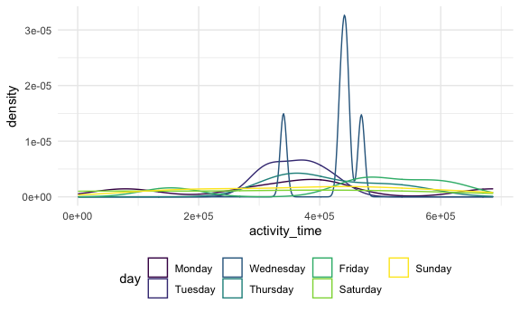

Homework 3
================
Megan Marziali

## Beginning infrastructure

This code chunk calls any relevant libraries and setting options.

``` r
library(tidyverse)
library(p8105.datasets)
library(ggridges)

knitr::opts_chunk$set(
  fig.width = 6,
  fig.asp = 0.6,
  out.width = "90%"
)

theme_set(theme_minimal() + theme(legend.position = "bottom"))

options(
  ggplot2.continuous.colour = "viridis",
  ggplot2.continuous.fill = "viridis"
)

scale_colour_discrete = scale_color_viridis_d
scale_fill_discrete = scale_fill_viridis_d
```

## Problem 1

#### Loading instacart dataset

The following code chunk loads the Instacart dataset

``` r
data("instacart")
```

The variables included in the instacart dataset are order\_id,
product\_id, add\_to\_cart\_order, reordered, user\_id, eval\_set,
order\_number, order\_dow, order\_hour\_of\_day,
days\_since\_prior\_order, product\_name, aisle\_id, department\_id,
aisle, department. There are a total of 1384617 observations, and 15
variables.

#### Answering specific questions

The following code is to check how many aisles.

## Problem 2

The following code is to load in the accelerometer data.

``` r
accel_df = 
  read_csv("./problem2/accel_data.csv",
           na = "") %>% 
  janitor::clean_names() %>% 
  pivot_longer(
    activity_1:activity_1440,
    names_to = "activity",
    names_prefix = "activity_",
    values_to = "measures"
  ) %>% 
  mutate(
    day_type = recode(
      day, 
      Monday = "Weekday",
      Tuesday = "Weekday",
      Wednesday = "Weekday",
      Thursday = "Weekday",
      Friday = "Weekday", 
      Saturday = "Weekend",
      Sunday = "Weekend"),
    day = factor(day),
    day = forcats::fct_relevel(day, c("Monday",
                                      "Tuesday",
                                      "Wednesday",
                                      "Thursday",
                                      "Friday",
                                      "Saturday",
                                      "Sunday")),
    activity = as.integer(activity)
  )
```

This dataset includes accelerometer data collected from a 65 year old
patient. The variables included are week, day\_id, day, activity,
measures, day\_type. There are a total of 50400 rows and 6 columns. The
total number of **activity** measurements taken is 1440. Measurements
were taken every Monday, Tuesday, Wednesday, Thursday, Friday, Saturday,
Sunday, for a total of 5 weeks and 35 days.

The value of the accelerometer readings as per the **measures** variable
ranges from 1 to 8982. The mean of the accelerometer readings is
267.0440592, with a standard deviation of 443.1575016. The median is 74,
with an IQR of 363.

### Aggregating data

The following code makes a table, aggregated by total activity per day.

``` r
accel_agg = 
  accel_df %>% 
  group_by(day) %>% 
  summarize(
    total_activity = sum(measures)
  ) %>% 
  knitr::kable(digits = 1)
```

It seems that the patient is the least active on Saturdays, and the most
active on Fridays. The patient is somewhat active on Mondays, Tuesdays,
and Sundays but more active on Wednesdays, Thursdays and Fridays.

``` r
accel_df %>% 
  group_by(day_id, day) %>% 
  summarize(
    activity_time = sum(measures)
  ) %>% 
  ggplot(aes(x = activity_time, color = day)) +
  geom_density()
```



## Problem 3

The following code loads in the appropriate dataset.

``` r
data("ny_noaa")
```

The following code cleans and tidies the data.
