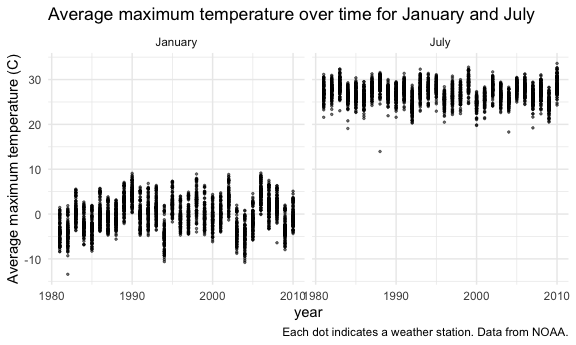

Homework 3
================
Megan Marziali

## Beginning infrastructure

This code chunk calls any relevant libraries and setting options.

``` r
library(tidyverse)
library(p8105.datasets)
library(patchwork)

knitr::opts_chunk$set(
  fig.width = 6,
  fig.asp = 0.6,
  out.width = "90%"
)

theme_set(theme_minimal() + theme(legend.position = "bottom"))

options(
  ggplot2.continuous.colour = "viridis",
  ggplot2.continuous.fill = "viridis"
)

scale_colour_discrete = scale_color_viridis_d
scale_fill_discrete = scale_fill_viridis_d
```

## Problem 1: Instacart

#### Loading instacart dataset

The following code chunk loads the Instacart dataset

``` r
data("instacart")
```

This dataset contains 1384617 rows and 15 columns. Observations are the
level of items in orders by users of instacart. There are user and order
variables – user\_id, order id, order day, and order hour. There are
also item variables – name, aisle, department and some numeric codes.

#### Answering specific questions

The following code is to check how many aisles there are which are
ordered from.

``` r
instacart %>% 
  count(aisle) %>% 
  arrange(desc(n))
```

Now, we need to make a plot of the number of orders purchased per aisle.

``` r
instacart %>% 
  count(aisle) %>% 
  filter(n > 10000) %>% 
  mutate(
    aisle = factor(aisle),
    aisle = fct_reorder(aisle, n)
  ) %>% 
  ggplot(aes(x = aisle, y = n)) + 
  geom_point() +
  theme(axis.text.x = element_text(angle = 90, vjust = 0.5, hjust = 1)) +
  labs(
    title = "Aisle order plot",
    x = "Aisle names",
    y = "Number of orders",
    caption = "Data from instacart."
    )
```


The next step is to make a table showing the most popular items.

``` r
instacart %>% 
  filter(aisle %in% c(
    "baking ingredients", "dog food care", "packaged vegetables fruits")) %>% 
  group_by(aisle) %>% 
  count(product_name) %>% 
  mutate(rank = min_rank(desc(n))) %>% 
  filter(rank < 4) %>% 
  arrange(aisle, rank) %>% 
  knitr::kable()
```

| aisle                      | product\_name                                 |    n | rank |
| :------------------------- | :-------------------------------------------- | ---: | ---: |
| baking ingredients         | Light Brown Sugar                             |  499 |    1 |
| baking ingredients         | Pure Baking Soda                              |  387 |    2 |
| baking ingredients         | Cane Sugar                                    |  336 |    3 |
| dog food care              | Snack Sticks Chicken & Rice Recipe Dog Treats |   30 |    1 |
| dog food care              | Organix Chicken & Brown Rice Recipe           |   28 |    2 |
| dog food care              | Small Dog Biscuits                            |   26 |    3 |
| packaged vegetables fruits | Organic Baby Spinach                          | 9784 |    1 |
| packaged vegetables fruits | Organic Raspberries                           | 5546 |    2 |
| packaged vegetables fruits | Organic Blueberries                           | 4966 |    3 |

The next step is to make a table of the mean hour at which specific
items are ordered.

``` r
instacart %>% 
  filter(product_name %in% c("Pink Lady Apples", "Coffee Ice Cream")) %>% 
  group_by(product_name, order_dow) %>% 
  summarize(mean_hour = mean(order_hour_of_day)) %>% 
  pivot_wider(
    names_from = order_dow,
    values_from = mean_hour
  ) %>% 
  knitr::kable()
```

| product\_name    |        0 |        1 |        2 |        3 |        4 |        5 |        6 |
| :--------------- | -------: | -------: | -------: | -------: | -------: | -------: | -------: |
| Coffee Ice Cream | 13.77419 | 14.31579 | 15.38095 | 15.31818 | 15.21739 | 12.26316 | 13.83333 |
| Pink Lady Apples | 13.44118 | 11.36000 | 11.70213 | 14.25000 | 11.55172 | 12.78431 | 11.93750 |

## Problem 2: Accelerometer

The following code is to load in the accelerometer data.

``` r
accel_df = 
  read_csv("./problem2/accel_data.csv",
           na = "") %>% 
  janitor::clean_names() %>% 
  pivot_longer(
    activity_1:activity_1440,
    names_to = "minute",
    names_prefix = "activity_",
    values_to = "activity_count"
  ) %>% 
  mutate(
    day_type = recode(
      day, 
      Monday = "Weekday",
      Tuesday = "Weekday",
      Wednesday = "Weekday",
      Thursday = "Weekday",
      Friday = "Weekday", 
      Saturday = "Weekend",
      Sunday = "Weekend"),
    day = factor(day),
    day = forcats::fct_relevel(day, c("Monday",
                                      "Tuesday",
                                      "Wednesday",
                                      "Thursday",
                                      "Friday",
                                      "Saturday",
                                      "Sunday")),
    minute = as.integer(minute)
  )
```

This dataset includes accelerometer data collected from a 65 year old
patient. Observations correspond to activity counts over the course of
24 hours. The variables included are week, day\_id, day, minute,
activity\_count, day\_type. There are a total of 50400 rows and 6
columns. Activity counts were taken every minute of the day, for a total
of 1440 minutes. Measurements were taken every Monday, Tuesday,
Wednesday, Thursday, Friday, Saturday, Sunday, for a total of 5 weeks
and 35 days.

The value of the accelerometer readings as per the activity\_count
variable ranges from 1 to 8982. The mean of the accelerometer readings
is 267.0440592, with a standard deviation of 443.1575016. The median is
74, with an IQR of 363.

### Aggregating data

The following code makes a table, aggregated by total activity per day.

``` r
accel_df %>% 
  group_by(day, day_id) %>% 
  summarize(
    total_activity = sum(activity_count)
  ) %>% 
  pivot_wider(
    names_from = "day",
    values_from = "total_activity"
  ) %>% 
  knitr::kable(digits = 1)
```

| day\_id |   Monday |  Tuesday | Wednesday | Thursday |   Friday | Saturday | Sunday |
| ------: | -------: | -------: | --------: | -------: | -------: | -------: | -----: |
|       2 |  78828.1 |       NA |        NA |       NA |       NA |       NA |     NA |
|       9 | 295431.0 |       NA |        NA |       NA |       NA |       NA |     NA |
|      16 | 685910.0 |       NA |        NA |       NA |       NA |       NA |     NA |
|      23 | 409450.0 |       NA |        NA |       NA |       NA |       NA |     NA |
|      30 | 389080.0 |       NA |        NA |       NA |       NA |       NA |     NA |
|       6 |       NA | 307094.2 |        NA |       NA |       NA |       NA |     NA |
|      13 |       NA | 423245.0 |        NA |       NA |       NA |       NA |     NA |
|      20 |       NA | 381507.0 |        NA |       NA |       NA |       NA |     NA |
|      27 |       NA | 319568.0 |        NA |       NA |       NA |       NA |     NA |
|      34 |       NA | 367824.0 |        NA |       NA |       NA |       NA |     NA |
|       7 |       NA |       NA |    340115 |       NA |       NA |       NA |     NA |
|      14 |       NA |       NA |    440962 |       NA |       NA |       NA |     NA |
|      21 |       NA |       NA |    468869 |       NA |       NA |       NA |     NA |
|      28 |       NA |       NA |    434460 |       NA |       NA |       NA |     NA |
|      35 |       NA |       NA |    445366 |       NA |       NA |       NA |     NA |
|       5 |       NA |       NA |        NA | 355923.6 |       NA |       NA |     NA |
|      12 |       NA |       NA |        NA | 474048.0 |       NA |       NA |     NA |
|      19 |       NA |       NA |        NA | 371230.0 |       NA |       NA |     NA |
|      26 |       NA |       NA |        NA | 340291.0 |       NA |       NA |     NA |
|      33 |       NA |       NA |        NA | 549658.0 |       NA |       NA |     NA |
|       1 |       NA |       NA |        NA |       NA | 480542.6 |       NA |     NA |
|       8 |       NA |       NA |        NA |       NA | 568839.0 |       NA |     NA |
|      15 |       NA |       NA |        NA |       NA | 467420.0 |       NA |     NA |
|      22 |       NA |       NA |        NA |       NA | 154049.0 |       NA |     NA |
|      29 |       NA |       NA |        NA |       NA | 620860.0 |       NA |     NA |
|       3 |       NA |       NA |        NA |       NA |       NA |   376254 |     NA |
|      10 |       NA |       NA |        NA |       NA |       NA |   607175 |     NA |
|      17 |       NA |       NA |        NA |       NA |       NA |   382928 |     NA |
|      24 |       NA |       NA |        NA |       NA |       NA |     1440 |     NA |
|      31 |       NA |       NA |        NA |       NA |       NA |     1440 |     NA |
|       4 |       NA |       NA |        NA |       NA |       NA |       NA | 631105 |
|      11 |       NA |       NA |        NA |       NA |       NA |       NA | 422018 |
|      18 |       NA |       NA |        NA |       NA |       NA |       NA | 467052 |
|      25 |       NA |       NA |        NA |       NA |       NA |       NA | 260617 |
|      32 |       NA |       NA |        NA |       NA |       NA |       NA | 138421 |

It seems that the patient is the least active on Saturdays, particularly
in the last two weeks. The patient seems the most active on Fridays, and
potentially on Mondays. Certain days seem more consistent related to
activity level than others (such as Tuesdays, Wednesdays and Thursdays).

``` r
accel_df %>% 
  ggplot(aes(x = minute, y = activity_count, color = day)) +
  geom_smooth(se = FALSE) +
  labs(
    title = "Activity count over time of day",
    x = "Minutes",
    y = "Activity",
    caption = "Data from patient accelerometer."
    )
```


It seems that the patient is active more during the day on Sundays, and
more active in the evening on Fridays. The time at which the patient is
most active depends on the day. The patient also seems to be more active
during the week than on the weekend and more active at certain points in
the day. There is a peak on Sundays around minute 500, and on Fridays at
around minute 1250.

## Problem 3: NY NOAA

The following code loads in the NY NOAA dataset.

``` r
data("ny_noaa")
```

#### Cleaning and tidying

The following code cleans and tidies the data.

``` r
noaa_clean = 
  ny_noaa %>% 
  janitor::clean_names() %>% 
  separate(
    date,
    sep = "-",
    into = c("year", "month", "day")
  ) %>% 
  mutate(
    year = as.integer(year),
    month = as.integer(month),
    day = as.integer(day),
    prcp = prcp/10,
    tmax = as.integer(tmax)/10,
    tmin = as.integer(tmin)/10
  )
```

The NOAA dataset is from the National Climactic Data Center, and
includes variables id, year, month, day, prcp, snow, snwd, tmax, tmin.
There are 9 columns and 2595176 rows in this dataset. Observations
relate to climate measures of various weather stations.

The time period of this data ranges from 1981 to 2010. Ranges of climate
variables are from: 0 to 2286 for precipitation (mm); -13 to 10160 for
snowfall (mm); 0 to 9195 for snow depth (mm);-59.4 to 60 for minimum
temperatures (C); and, -38.9 to 60 for maximum temperatures (C).

There are 3387623 total missing observations, which is a large amount of
missingness for this dataset.

#### Common snowfall

The following code assesses the most commonly observed values for
snowfall.

``` r
noaa_clean %>% 
  count(snow) %>% 
  arrange(desc(n))
```

The most common observed value for snowfall is 0 mm of snowfall. This
could suggest either seasonality of snowfall, or that some weather
stations are located in areas that are less likely to have snowfall
compared to others.

The second most common value is “NA”, which is expected given the large
amount of missingness observed in the dataset.

#### Two-panel max temperature month plot

The following code makes a two-panel plot showing the average max
temperature in January and July.

``` r
month_df = 
  tibble(
    month = 1:12,
    month_name = month.name)

noaa_month = 
  left_join(noaa_clean, month_df, by = "month") %>% 
  select(-month)

noaa_month %>% 
  group_by(id, year, month_name) %>% 
  summarize(
    average = mean(tmax)
  ) %>% 
  filter(month_name %in% c("January", "July")) %>% 
  ggplot(aes(x = year, y = average)) +
  geom_point(alpha = 0.5, size = 0.5) +
  facet_grid(. ~ month_name) +
  labs(
    title = "Average maximum temperature over time for January and July",
    y = "Average maximum temperature (C)",
    caption = "Each dot indicates a weather station. Data from NOAA."
  )
```



In general, the average maximum temperatures in January are lower than
they are in July. It seems that there is one discernable outlier in
January in 1981, where the temperature is very cold. There seem to be
more outliers in July than in January. July outliers suggest abnormally
cold temperatures.

#### Two-panel tmax/tmin and snowfall distribution plot

Making a two-panel plot showing (i) tmax and tmin and (ii) plot showing
the distribution of snowfall values greater than 0 and less than 100
separately by year

``` r
tmax_tmin_plot = 
  noaa_clean %>% 
  select(tmax, tmin) %>% 
  ggplot(aes(x = tmax, y = tmin)) +
  geom_hex() +
  theme(legend.position = "none") +
  labs(
    x = "Maximum temperature (C)",
    y = "Minimum temperature (C)",
    title = "Maximum versus minimum temperature (C)"
  )

snow_dens_plot = 
  noaa_clean %>% 
  filter(
    snow < 100,
    snow > 0
  ) %>% 
  ggplot(aes(group = year, x = year, y = snow)) +
  geom_boxplot() +
  theme(legend.position = "none") +
  labs(
    x = "Year",
    y = "Snowfall (mm)",
    title = "Distribution of snowfall by year"
  )

tmax_tmin_plot / snow_dens_plot
```


